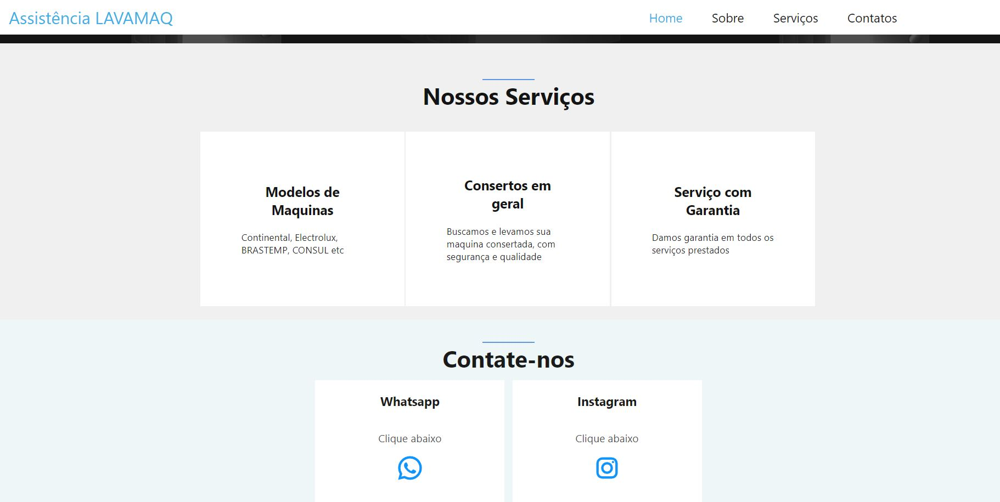
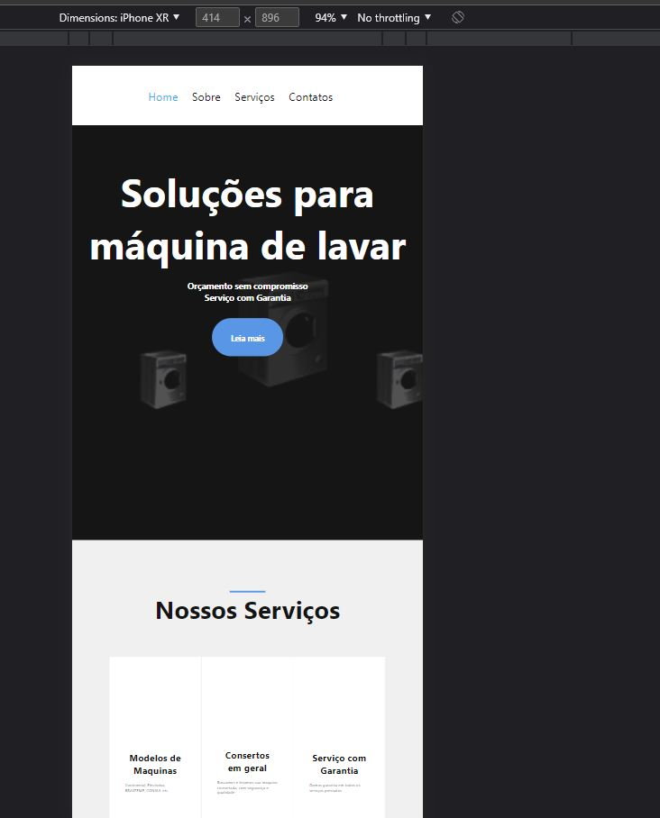
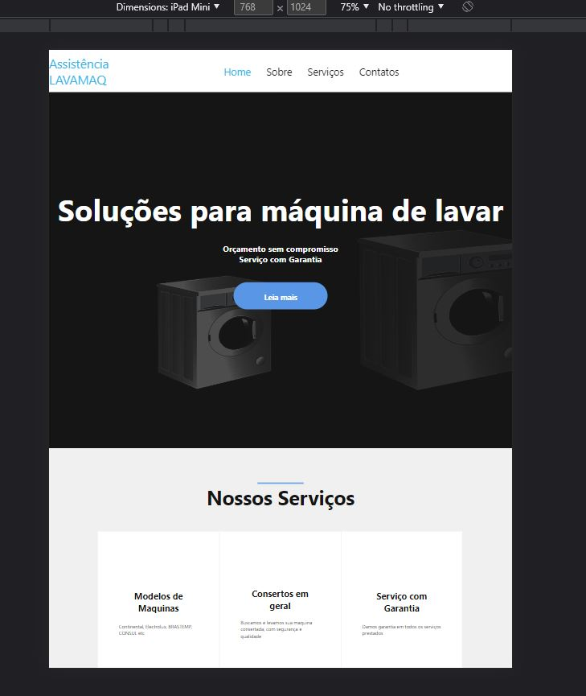

## <h1> 🖼 Freelancer Landing Page Laundry Machine</h1>  
<h3  style="color:red;">Link to the Page Click Below - Para Acessar a Página click abaixo<h3>
<a href="https://lewisc99.github.io/freelancer-work-static-landing-page-laundry-machine/Index" target="_blank">Click Here</a>
 

<h2>Description English</h2>

 Landing Page created for a Freelancer, using the best of CSS,  responsible Website, using less code,
 This page can be fit to any Size of Screen, and the User can Zoom Out and In to any size.

<h2>Descrição Português</h2>

 Landing Page criada para um Freelancer,
 usando o melhor do CSS, Site responsivo, usando menos código, 
Esta página pode ser ajustada a qualquer tamanho de tela,
 e o usuário pode diminuir e diminuir o zoom em qualquer tamanho.

 
## 🚀 Tech 
 
- HTML and CSS 
- Jquery 
 

## 🖼 Screenshot APPLICATION SCREENS  

 
 

## Linkedin Below - Linkedin ABaixo

<h4 align="center">
   Created by   <a href="https://www.linkedin.com/in/luiz-carlos-b50693173/" target="_blank"> Luiz Carlos </a>
</h4>

</html>
